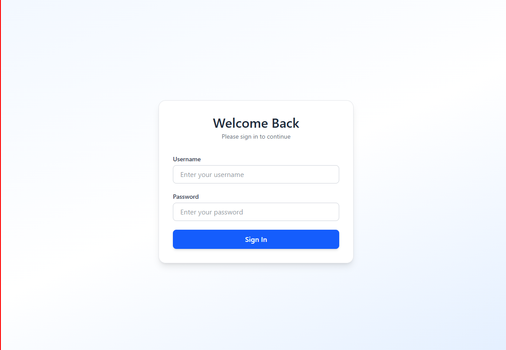
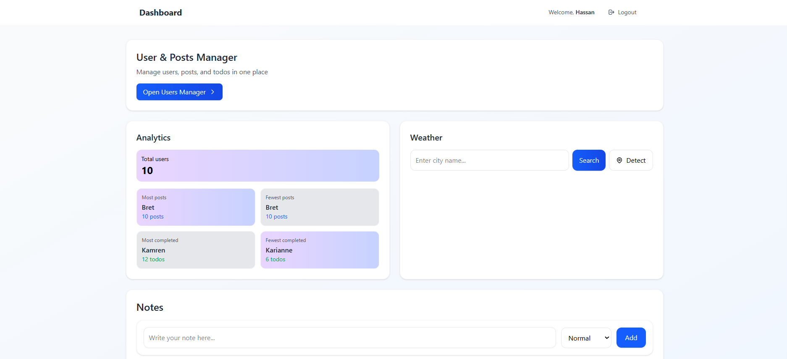
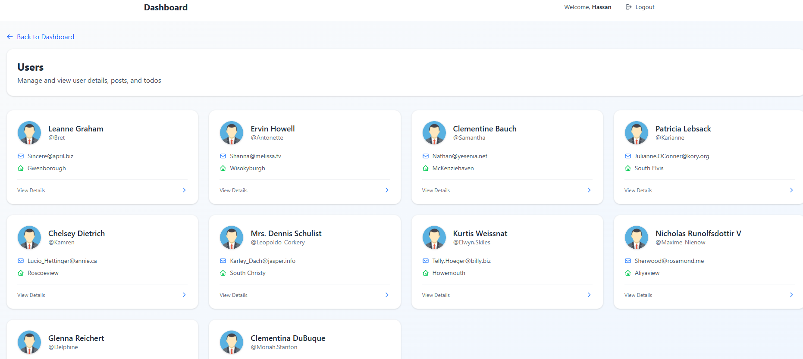
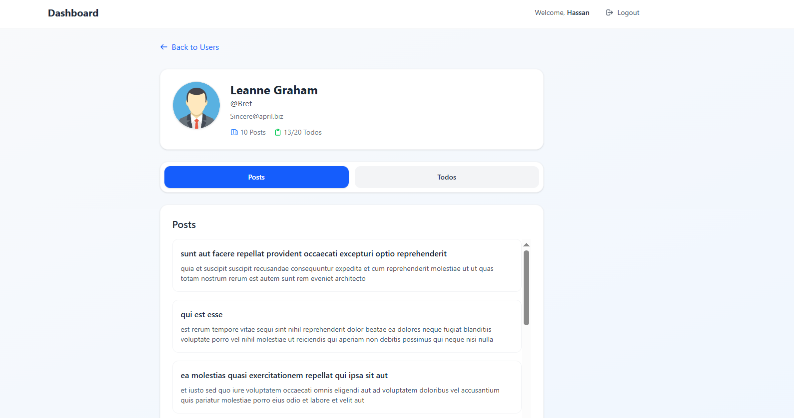
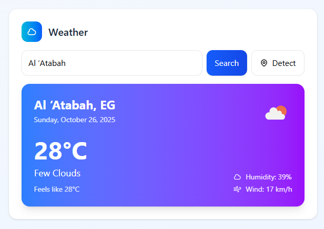

# 🌟 Dashboard

A **React + TypeScript** dashboard app built with **Vite**, **Tailwind CSS**, and **React Router**.
This project includes authentication, user management, notes, analytics, and a real-time weather widget.

---

## 🚀 Features

### 🔐 Login Page

* Dummy credentials:
  **Username:** `admin`
  **Password:** `password`
* Uses Context API to manage authentication state.
* Redirects to `/dashboard` on successful login.

---

### 📊 Dashboard Overview

Contains four feature cards:

#### 1️⃣ User & Posts Manager

* Fetches users from [JSONPlaceholder API](https://jsonplaceholder.typicode.com/users).
* Click a user to view:

  * User details.
  * Posts.
  * To-dos (toggle done/undone, state persists via localStorage).

#### 2️⃣ Notes Manager

* Add notes with **priority** (`important`, `normal`, `delayed`).
* Manage notes with **drag & drop** using `react-beautiful-dnd`.
* Edit or delete notes.
* Notes persist in **localStorage**.

#### 3️⃣ Simple Analytics

* Displays:

  * Total number of users.
  * User with most/fewest posts.
  * User with most/fewest completed todos.

#### 4️⃣ Weather Widget

* Fetches live weather data from **OpenWeatherMap API**.
* Search by city or detect your current location.
* Displays:

  * City name
  * Temperature (°C)
  * Weather description
  * Humidity
  * Weather icon
* Handles loading and error states.

---

## 🛠️ Tech Stack

| Category         | Tool                                                                    |
| ---------------- | ----------------------------------------------------------------------- |
| Framework        | [React](https://react.dev/)                                             |
| Build Tool       | [Vite](https://vitejs.dev/)                                             |
| Language         | [TypeScript](https://www.typescriptlang.org/)                           |
| Styling          | [Tailwind CSS](https://tailwindcss.com/)                                |
| State Management | Context API / React Query                                               |
| API Calls        | [Axios](https://axios-http.com/)                                        |

---

## ⚙️ Installation & Setup

### 1️⃣ Clone the repository

```bash
git clone https://github.com/hassanmahmoud334/final_project_react.git
cd final_project_react
```

### 2️⃣ Install dependencies

```bash
npm install
```

### 3️⃣ Add your OpenWeatherMap API key

Create a `.env` file in the project root:

```bash
VITE_WEATHER_API_KEY=your_api_key_here
```

### 4️⃣ Run the project

```bash
npm run dev
```

App runs on **[http://localhost:5173](http://localhost:5173)**

### 5️⃣ Build for production

```bash
npm run build
```

Output is in the `/dist` folder.

---

## 🧩 Folder Structure

---

## 🔒 Dummy Credentials

| Username | Password |
| -------- | -------- |
| admin    | password |

---


## 💡 Author

Developed by **Hassan M. Ahmed**

---

## 🧭 App Preview

### 🔐 Login Page


### 🏠 Dashboard


### 🗒️ Users Manager


### 🗒️ Todos Manager


### 🌤️ Weather Widget


---
